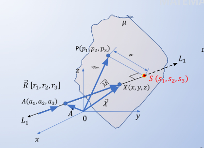

# Primer Parcial
#### Ejercicio 1

#### Ejercicio 2

#### Ejercicio 3
Resolver el siguiente sistema de ecuaciones lineales por el método de matriz inversa:
$$
\begin{cases}
3x + 2y + z = 6 \\
1x + 1y - z = 3 \\
-4x + 3y + 4z = 7
\end{cases}
$$

#### Ejercicio 4
De acuerdo a la definición de un determinante, establezca para un determinante de orden $N$, el número de términos y la cantidad de factores por términos.

**Respuesta:**
El determinante se conseguirá con $N!$ términos de $N$ factores. Si $N$ es $5$, el determinante tendrá $5! = 120$ términos de $5$ factores cada uno.

# Práctica 1
Determine la distancia $d$ desde el punto $P$ hasta la recta $L_1$

**Datos:**
$P(p_1, p_2, p_3)$
Un punto $S$ en la recta $L_1$: $S(s_1, s_2, s_3)$
$S$ es el punto de la recta $L_1$ más cercano a $P$.

**Respuesta:**
Nos queda que $d = \sqrt{(s_1 - p_1)^2 + (s_2 - p_2)^2 + (s_3 - p_3)^2}$
Y nos falta por conocer las coordenadas del punto $S$.
Para conocer las coordenadas del punto $S$, sabemos que al ser el punto más cercano a $P$ contenida en $L_1$, debería estar en un plano perpendicular a $L_1$ que contiene a $P$ también.

$$ L_1 = \lambda\vec{R} + \vec{A} $$
$$
\begin{cases}
x = \lambda r_1 + a_1 \\
y = \lambda r_2 + a_2 \\
z = \lambda r_3 + a_3
\end{cases}
$$
Como $S$ está en la recta, buscamos el valor de $\lambda$ que nos de el punto más cercano a $P$.
Diremos entonces, que $S(s_1, s_2, s_3)$, será tal que:
$$
\begin{cases}
s_1 = T(r_1) + a_1 \\
s_2 = T(r_2) + a_2 \\
s_3 = T(r_3) + a_3
\end{cases}
$$
Donde $T$ es el valor: 
$$ T = \frac{(p_1 - a_1)r_1 + (p_2 - a_2)r_2 + (p_3 - a_3)r_3}{r_1^2 + r_2^2 + r_3^2} $$

 Y se obtiene de la siguiente manera: 

Conocemos un punto y el vector director de la línea a la que el plano es perpendicular. 

Se puede aplicar la fórmula de planos: $\vec{R}\cdot\vec{P} = \vec{R}\cdot\vec{S}$

$$
[r_1, r_2, r_3] \cdot [p_1, p_2, p_3] = 
[r_1, r_2, r_3] \cdot [Tr_1 + a_1, Tr_2 + a_2, Tr_3 + a_3]
$$
$$
r_1p_1 + r_2p_2 + r_3p_3 = Tr_1^2 + a_1r_1 + Tr_2^2 + a_2r_2 + Tr_3^2 + a_3r_3
$$
Despejamos la T 

$$
Tr_1^2 + Tr_2^2 + Tr_3^2 = r_1p_1 + r_2p_2 + r_3p_3 - a_1r_1 - a_2r_2 - a_3r_3
$$
$$
T(r_1^2 + r_2^2 + r_3^2) = r_1p_1 + r_2p_2 + r_3p_3 - a_1r_1 - a_2r_2 - a_3r_3
$$
$$
T = \frac{r_1p_1 + r_2p_2 + r_3p_3 - a_1r_1 - a_2r_2 - a_3r_3}{r_1^2 + r_2^2 + r_3^2}
$$
Y conociendo $T$, podemos conocer las coordenadas de $S$.

**
 Terminado 
**

&nbsp;
&nbsp;
&nbsp;
# Práctica 2
(Tanto para este ejercicio como para el siguiente, el punto clave es que no se debe encontrar contradicciones al momento de buscar los valores de las fórmulas. Si hay contradicciones en los valores, entonces las reglas no se cumplen.)

Determine si los vectores $\vec{V} = (3, -1)$ y $\vec{U} = (-9, 3)$ son paralelos.
En dado caso que sean paralelos, debe existir una constante $k$ tal que $\vec{V} = k\vec{U}$, por tanto colocamos nuestro sistema de ecuaciones:
$$
\begin{cases}
    3 = -9k \\
    -1 = 3k
\end{cases}
$$
$$
\begin{cases}
    k = \frac{3}{-9} \\
    k = \frac{-1}{3}
\end{cases}
$$
$$
\begin{cases}
    k = -\frac{1}{3} \\
    k = -\frac{1}{3}
\end{cases}
$$
Ambos vectores son paralelos ya que tienen la misma pendiente. El vector $\vec{V}$ es un múltiplo escalar del vector $\vec{U}$, de la forma: $\vec{V} = -\frac{1}{3} \vec{U}$
**
 Terminado 
**

&nbsp; 
&nbsp;
&nbsp;
# Práctica 3
Indicar si el vector $\vec{W}$ pertenece al plano formado por los vectores $\vec{U}$ y $\vec{V}$.
$$
\vec{W} = (3, 3, 3) \quad 
\vec{U} = (1, 0, 1) \quad
\vec{V} = (0, 2, 0)
$$
Para que el vector $\vec{W}$ pertenezca al plano formado por los vectores $\vec{U}$ y $\vec{V}$, debe existir una combinación lineal de $\vec{U}$ y $\vec{V}$ que nos de $\vec{W}$.
$$
\vec{W} = \alpha\vec{U} + \beta\vec{V}
$$
$$
[3,\quad 3,\quad 3] = [\alpha1,\quad 0,\quad \alpha1] + [0,\quad \beta2,\quad 0]
$$
$$
[3,\quad 3,\quad 3] = [\alpha1 + 0,\quad 0 + \beta2,\quad \alpha1 + 0]
$$
$$
[3,\quad 3,\quad 3] = [\alpha1,\quad \beta2,\quad \alpha1]
$$
Y nos queda el siguiente sistema de ecuaciones:
$$
\begin{cases}
    3 = \alpha \\
    3 = 2\beta \\
    3 = \alpha
\end{cases}
$$
Donde:
$$
\begin{cases}
    \alpha = 3 \\
    \beta = \frac{3}{2}
\end{cases}
$$

Por tanto, el vector $\vec{W}$ pertenece al plano formado por los vectores $\vec{U}$ y $\vec{V}$. En la igualdad: $\vec{W} = 3\vec{U} + \frac{3}{2}\vec{V}$
**
 Terminado 
**

&nbsp;
&nbsp;
&nbsp;
# Práctica 4
Encontrar un vector en la misma dirección que $\vec{V}(-2,\quad 4, \quad 2)$ pero longitud igual a 6.

Método: 
Encontramos el versor de $\vec{V}$ y lo multiplicamos por 6. Esto se debe que el versor $\hat{V}$ va en la dirección de $\vec{V}$ y como es módulo 1, multiplicarlo por 6 lo dejará en módulo 6.

Respuesta:
Calculamos el vector unitario $\hat{V}$
$$
|\vec{V}| = \sqrt{(-2)^2 + 4^2 + 2^2} = \sqrt{24} = 2\sqrt{6} 
$$
$$
\hat{V} = \frac{\vec{V}}{|\vec{V}|} = \frac{1}{2\sqrt{6}}(-2,\quad 4, \quad 2) = (-\frac{1}{\sqrt{6}},\quad \frac{2}{\sqrt{6}}, \quad \frac{1}{\sqrt{6}})
$$
Y ahora multiplicamos el versor por 6 para obtener el vector en la misma dirección que $\vec{V}$ pero con longitud 6.
$$
6\hat{V} = 6(-\frac{1}{\sqrt{6}},\quad \frac{2}{\sqrt{6}}, \quad \frac{1}{\sqrt{6}}) = (-\sqrt{6},\quad 2\sqrt{6}, \quad \sqrt{6})
$$

**
 Terminado 
**

&nbsp;
&nbsp;
&nbsp;
# Práctica 5 
Encontrar un vector perpendicular a $\vec{U}(1,\quad 2, \quad 3)$ y $\vec{V}(2,\quad 3, \quad 4)$.

Método:
Encontramos el producto cruz de $\vec{U}$ y $\vec{V}$, y el resultado será un vector perpendicular a ambos.

Respuesta:
$$
\vec{U} \times \vec{V} =
\begin{vmatrix}
    \hat{i} & \hat{j} & \hat{k} \\
    1 & 2 & 3 \\
    2 & 3 & 4 \\
\end{vmatrix}
$$
$$
\vec{U} \times \vec{V} = 
(2*4 - 3*3)\hat{i} - (1*4 - 3*2)\hat{j} + (1*3 - 2*2)\hat{k} 
$$
$$
= (8 - 9)\hat{i} - (4 - 6)\hat{j} + (3 - 4)\hat{k} = -\hat{i} + 2\hat{j} - \hat{k}
$$
Por tanto, el vector $-\hat{i} + 2\hat{j} - \hat{k}$ es perpendicular a $\vec{U}$ y $\vec{V}$.

**
 Terminado 
**

&nbsp;
&nbsp;
&nbsp;
# Práctica 6 
Encontrar los vectores unitarios que son paralelos a la recta tangente a la función $y=x^2$ en el punto $(2,4)$.

#### Método:
Notar que el ejercicio solicita un vector unitario paralelo a la recta tangente. Por tanto, explícitamente no necesitamos la recta, necesitamos: un vector adentro de la recta, que por definición al estar adentro de la recta sería paralelo en concepto de vector, y luego buscar el unitario.

Notamos, por tanto, que como es un vector, no está explícitamente posicionado en el espacio y eso nos permite solo trabajar con la dirección y sentido de la pendiente de la recta. Además, tampoco importa la magnitud del vector, después de todo obtendremos el vector unitario luego de obtener el vector.

Por lo expresado anteriormente, el vector solo debe respetar la pendiente. Esto se logra a través de la primera derivada de la función calculada en el punto en el cual queremos que sea perpendicular. Obtenida la pendiente, buscaremos un vector que respete esta pendiente.

En el caso del ejercicio, tenemos que el vector tiene dos dimensiones, al igual que la recta. Por tanto, buscamos ambas dimensiones del vector $\vec{V}:(x, \quad y)$. Por definición, tenemos que una pendiente es de la forma $m = \frac{\Delta y}{\Delta x}$. De esa fórmula podemos obtener las dimensiones del vector paralelo a esa recta.

#### Respuesta:
$$
y = x^2 \quad \rightarrow \quad y' = 2x 
$$
$$
y'(2) = 2(2) = 4
$$
La pendiente nos queda 4, y según lo explicado arriba del vector de la pendiente: 
$$
\vec{M} = (1, 4)
$$
Ahora, para encontrar el vector unitario de la pendiente, lo dividimos entre su módulo, pero, existen 2 vectores unitarios, uno apuntando positivamente, otro apuntando negativamente. Serán:
$$
\hat{M} = \frac{\vec{M}}{|\vec{M}|} = \frac{1}{\sqrt{1^2 + 4^2}}(1, 4) = (\frac{1}{\sqrt{17}}, \frac{4}{\sqrt{17}})
$$
Ese es el vector unitario positivo, el negativo sería el mismo pero con signos negativos:
$$
-\hat{M} = -(\frac{1}{\sqrt{17}}, \frac{4}{\sqrt{17}}) = (-\frac{1}{\sqrt{17}}, -\frac{4}{\sqrt{17}})
$$

**
 Terminado 
**

&nbsp;
&nbsp;
&nbsp;
# Práctica 7
Demostrar que los puntos $P(0, \quad -2, \quad 4)$, $Q(1, \quad -3, \quad 5)$ y $R(4, \quad -6, \quad 8)$ son colineales.

#### Método:
1) 
Con colineales se hace referencia a que los puntos están en la misma recta. Por tanto, si los puntos están en la misma recta, entonces la pendiente entre dos puntos cualesquiera de los 3 puntos debe ser la misma. Por tanto, si la pendiente entre $P$ y $Q$ es igual a la pendiente entre $Q$ y $R$, entonces los 3 puntos están en la misma recta.

Para calcular esa pendiente, usamos la fórmula de la pendiente entre dos puntos:
$$
m = \frac{y_2 - y_1}{x_2 - x_1}
$$
Y como tenemos 3 puntos, podemos calcular 2 pendientes, y si son iguales, entonces los 3 puntos están en la misma recta.

2) 
Otra posibilidad es crear vectores entre los puntos, y si son paralelos, entonces los puntos están en la misma recta, por definición de vectores paralelos. Esto se haría, por ejemplo, con los vectores $\vec{PQ}$ y $\vec{PR}$, luego viendo si cumplen la característica de perpendicular entre vectores $\vec{PQ} = k\vec{PR}$, si lo cumple, ambos pertenecen a la misma recta y por tanto los pts que lo conforman pertenecen también a la misma recta.

#### Respuesta:
1)
$$
    m_{PQ} = \frac{-3 - (-2)}{1 - 0} = \frac{-1}{1} = -1 
$$
$$
    m_{QR} = \frac{-6 - (-3)}{4 - 1} = \frac{-3}{3} = -1 
$$
Como ambas pendientes son iguales, entonces los 3 puntos están en la misma recta.

2)
$$
    \vec{PQ} = (1 - 0, \quad -3 - (-2), \quad 5 - 4) = (1, \quad -1, \quad 1)
$$
$$
    \vec{PR} = (4 - 0, \quad -6 - (-2), \quad 8 - 4) = (4, \quad -4, \quad 4)
$$
$$
    \vec{PQ} = k\vec{PR} \quad \rightarrow \quad (1, \quad -1, \quad 1) = k(4, \quad -4, \quad 4)
$$
$$
    \frac{1}{4} = \frac{-1}{-4} = \frac{1}{4} \quad \rightarrow \quad k = \frac{1}{4}
$$
Por tanto, los vectores son paralelos, y por tanto los puntos están en la misma recta.

**
 Terminado 
**

&nbsp;
&nbsp;
&nbsp;
# Práctica 8
¿Qué restricciones deben tener $x, \quad y, \quad z$, para que el punto $(x,y,z)$ se encuentre:
a) sobre el eje y 
b) sobre el eje z
c) en el plano xz
d) en el plano yz

#### Método:
a) como es sobre el eje y, entonces es una combinación lineal del unitario de y. Por tanto, el vector sería expresado de la forma $\vec{V} = k\hat{y}$. Podemos observar, por tanto, que no cuenta con valores para $x$ o $z$.

b) como es sobre el eje z, entonces es una combinación lineal del unitario de z. Por tanto, el vector sería expresado de la forma $\vec{V} = k\hat{z}$. Podemos observar, por tanto, que no cuenta con valores para $x$ o $y$.

c) como es sobre el plano xz, entonces es una combinación lineal de los unitarios de x y z. Por tanto, el vector sería expresado de la forma $\vec{V} = k\hat{x} + l\hat{z}$. Podemos observar, por tanto, que no cuenta con valores para $y$.

d) como es sobre el plano yz, entonces es una combinación lineal de los unitarios de y y z. Por tanto, el vector sería expresado de la forma $\vec{V} = k\hat{y} + l\hat{z}$. Podemos observar, por tanto, que no cuenta con valores para $x$.

#### Respuesta:
a) (0, y, 0)
b) (0, 0, z)
c) (x, 0, z)
d) (0, y, z)

**
 Terminado 
**

&nbsp;
&nbsp;
&nbsp;
# Práctica 9
Calcular el vector unitario del vector $\vec{V} = (-4, \quad 2, \quad 4)$.

#### Método:
Para calcular el vector unitario, debemos dividir el vector entre su módulo. El módulo de un vector se calcula con la fórmula:
$$
    |\vec{V}| = \sqrt{x^2 + y^2 + z^2}
$$

#### Respuesta:
$$
    |\vec{V}| = \sqrt{(-4)^2 + 2^2 + 4^2} = \sqrt{16 + 4 + 16} = \sqrt{36} = 6 
$$
$$
    \hat{V} = \frac{\vec{V}}{|\vec{V}|} = \frac{1}{6}(-4, \quad 2, \quad 4) = (-\frac{4}{6}, \quad \frac{2}{6}, \quad \frac{4}{6}) = (-\frac{2}{3}, \quad \frac{1}{3}, \quad \frac{2}{3})
$$

**
 Terminado 
**

&nbsp;
&nbsp;
&nbsp;
# Práctica 10

