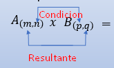
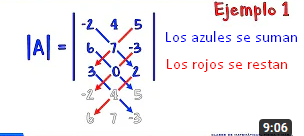

# Definición y notación
Conjunto bidimensional de números.  Una matriz se representa por medio de una letra mayúscula (A,B, …) y sus elementos con la misma letra en minúscula (a,b, …), con un doble subíndice donde el primero indica la fila y el segundo la columna a la que pertenece.

### Notación
Se denotan de la forma ***An x m*** , donde ***n*** son las filas, ***m*** son las columnas.
Los elementos genéricos de la matriz ***A*** se conocen como ***aij***, siendo ***i*** la fila, siendo ***j*** la columna del elemento.

Los elementos ***aij*** tales que "***i = j***" se consideran diagonal principal (en todo tamaño de matrices).

# Operaciones de Matrices
## Suma de matrices
En el caso de matrices de iguales dimensiones (mismas filas y columnas), la suma de matrices "***C = A + B***" se define tal que: ***cij = aij + bij*** 
No se puede hacer suma entre matrices de distinto tamaño.

##### Propiedades interesantes
Simétrico Aditivo:  A  + (-A) = O
Identidad Aditiva:  A  +  O = A
// Notar que O es la matriz nula de la forma todo oij = 0

## Multiplicación Escalar - Matriz
Se hace de la forma: escalar * ***A*** -> escalar * ***aij*** 
para todos los elementos de A

## Multiplicación de Matrices

Para multiplicar matrices, las columnas de la primera matriz han de ser iguales a las filas de la segunda matriz (**n = p**). La matriz resultante **C** será una matriz con las filas de la primera matriz y las columnas de la segunda (**C m x q **)

#### Método de multiplicación
Se multiplica la fila de la primera por la columna de la segunda. Si se multiplica la fila ***i*** de la primera por la columna ***q*** de la segunda, ese será el elemento ***ciq***

Se multiplicará en sucesión: ***elemento enésimo*** de la fila ***i*** por el elemento enésimo de la columna ***q*** en cada iteracción de la fila ***i***, por la columna ***q***.

# Determinantes
El determinante de una matriz cuadrada **A** de dimensión **n** (**nxn**), es la suma de todos los (**n!**) productos(terminos sumando) posibles de **n** factores en que los factores de compondrán de un elemento de cada fila y columna. 

#### Método de Sarrus 3x3:

#### Método de Sarrus 2x2:
$$
|A| = 
\det
\begin{bmatrix}
    a & b \\
    m & n
\end{bmatrix} 
= 
\begin{vmatrix}
    a & b \\
    m & n
\end{vmatrix} 
= an - bm
$$
#### Método de Menor Complementarios:
La determinante de una matriz **A** es la suma de los **menores complementarios** de todos los elementos de una fila o columna (se elige arbitrariamente).

Los menores complementarios de un elemento ***aij*** es el elemento ***aij*** multiplicado por la determinante de la matriz resultante de eliminar la fila ***i***, columna ***j*** de la matriz A.

Se utiliza la ley de los signos para conocer cual es el signo del menor complementario: se inicia en positivo y sigue negativo, de la forma:

 <b> Signo de los adjuntos </b> 

$$
\begin{vmatrix}
    + & - & + & - & + \\
    - & + & - & + & - \\
    + & - & + & - & + \\
    - & + & - & + & -
\end{vmatrix}
$$

# Propiedades de las Determinantes
1) |AT| = |A|
2) |A| = 0 si: 
    - A tiene una fila o columna de ceros
    - A tiene dos filas o columnas iguales
    - A tiene una fila o columna que es combinación lineal de otras filas o columnas
3) El determinante de una matriz triangular es el producto de los elementos de la diagonal principal.
4) Si en un determinante se intercambian dos filas o dos columnas, el determinante cambia de signo.
5) Si a los elementos de una línea de un determinante se le suman los elementos de otra línea paralela multiplicados por un escalar, el determinante no cambia.
6) Si se multiplican todos los elementos de una línea de un determinante por un escalar, el determinante se multiplica por ese escalar. Solo una línea.
7) |AB| = |A| * |B|

# Matrices Especiales
#### Matriz Cuadrada 
Es una matriz en la que el número de filas es igual al número de columnas. Una matriz de dimensión F*C, F=C.
$$
\begin{bmatrix}
    1 & 2 & 3 \\
    4 & 5 & 6 \\
    7 & 8 & 9
\end{bmatrix}
$$

#### Matriz Diagonal 
Es una matriz cuadrada en la que todos los elementos que no pertenecen a la diagonal principal son 0. 
$$
\begin{bmatrix}
    1 & 0 & 0 \\
    0 & 2 & 0 \\
    0 & 0 & 3
\end{bmatrix}
$$

#### Matriz Nula 
Es una matriz en la que todos sus elementos son 0. Se representa por **O**.
$$
\begin{bmatrix}
    0 & 0 & 0 \\
    0 & 0 & 0 \\
    0 & 0 & 0
\end{bmatrix}
$$

#### Matriz Identidad 
Es una matriz cuadrada en la que todos los elementos de la diagonal principal son 1 y el resto de elementos son 0. Se representa por **I**.
$$
\begin{bmatrix}
    1 & 0 & 0 \\
    0 & 1 & 0 \\
    0 & 0 & 1 
\end{bmatrix}
$$

#### Matriz Inversa
La matriz inversa de una matriz **A** es la matriz **A-1** tal que **A * A-1 = I** (matriz identidad). La determinante debe ser distinta de 0.
$$
A * A^{-1} = 
\begin{bmatrix} 
    1 & 2 \\
    3 & 4 
\end{bmatrix} 
\begin{bmatrix} 
    -2 & 1 \\ 
    3/2 & -1/2 
\end{bmatrix} 
= \begin{bmatrix} 
    1 & 0 \\
    0 & 1 
\end{bmatrix}
$$

#### Matriz Transpuesta
Matriz que se obtiene al cambiar las filas por las columnas de una matriz. Se representa por **AT**.
$$
A =
\begin{bmatrix} 
    1 & 2 \\
    3 & 4 \\
    m & n
\end{bmatrix}
\quad
A^T =
\begin{bmatrix} 
    1 & 3 & m \\
    2 & 4 & n
\end{bmatrix}
$$

#### Matriz Simétrica
Es una matriz cuadrada en la que todos los elementos de la diagonal principal son iguales a los elementos de la diagonal secundaria. **A = AT**.
$$
\begin{bmatrix} 
    1 & 2 & 3 \\
    2 & 4 & 5 \\
    3 & 5 & 6 
\end{bmatrix}
$$

#### Matriz Antisimétrica
Es una matriz cuadrada en la que todos los elementos de la diagonal principal son iguales a los elementos de la diagonal secundaria pero con signo contrario. **A = -AT**.
$$
\begin{bmatrix} 
    0 & 2 & -1 \\
    -2 & 0 & -4 \\
    1 & 4 & 0
\end{bmatrix}
$$

#### Matriz triangular superior
Es una matriz cuadrada en la que todos los elementos que están por debajo de la diagonal principal son 0.
$$
\begin{bmatrix} 
    1 & 2 & 3 \\
    0 & 4 & 5 \\
    0 & 0 & 6 
\end{bmatrix}
$$

#### Matriz triangular inferior
Es una matriz cuadrada en la que todos los elementos que están por encima de la diagonal principal son 0.
$$
\begin{bmatrix} 
    1 & 0 & 0 \\
    2 & 3 & 0 \\
    4 & 5 & 6 
\end{bmatrix}
$$

#### Matriz escalar
Es una matriz cuadrada en la que todos los elementos de la diagonal principal son iguales y el resto de elementos son 0.
$$
\begin{bmatrix} 
    2 & 0 & 0 \\
    0 & 2 & 0 \\
    0 & 0 & 2 
\end{bmatrix}
$$

# Cálculo de Matriz Inversa
#### Gauss-Jordan
Se crea una nueva matriz con la matriz A y la matriz identidad del tamaño de A, ambas pegadas por una raya vertical: $[A|I]$ . Se realiza el método de Gauss-Jordan sobre la matriz A, y el resultado de la anterior matriz identidad es la matriz inversa.

###### Ejemplo
$$
A =
\begin{bmatrix} 
    2 & 1 & 3 \\
    -1 & 2 & 4 \\
    0 & 1 & 3 
\end{bmatrix}
\quad
I =
\begin{bmatrix} 
    1 & 0 & 0 \\
    0 & 1 & 0 \\
    0 & 0 & 1 
\end{bmatrix}
$$
$$
[A|I] =
\begin{bmatrix} 
    2 & 1 & 3 & | & 1 & 0 & 0 \\
    -1 & 2 & 4 & | & 0 & 1 & 0 \\
    0 & 1 & 3 & | & 0 & 0 & 1
\end{bmatrix}
$$
$$
\begin{bmatrix} 
    -40 & 0 & 0 & | & -20 & 0 & 20 \\
    0 & 20 & 0 & | & 15 & 30 & -55 \\
    0 & 0 & -4 & | & 1 & 2 & -5 
\end{bmatrix}
$$
$$
\begin{bmatrix}
    1 & 0 & 0 & | & 1/2 & 0 & -1/2 \\
    0 & 1 & 0 & | & 3/4 & 3/2 & -11/4 \\
    0 & 0 & 1 & | & -1/4 & -1/2 & 5/4
\end{bmatrix}
$$

Entonces, 
$$
A^{-1} = \begin{bmatrix} 
    1/2 & 0 & -1/2 \\
    3/4 & 3/2 & -11/4 \\
    -1/4 & -1/2 & 5/4
\end{bmatrix}
$$

# Fuentes:
[mat-iii-matrices.pptx](../../laminas-profesor/mat-iii-matrices.pptx)
